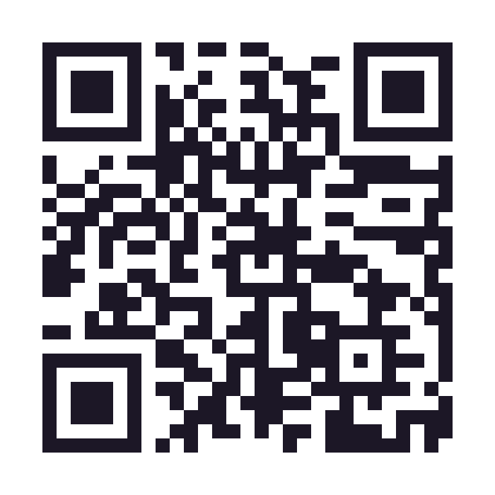
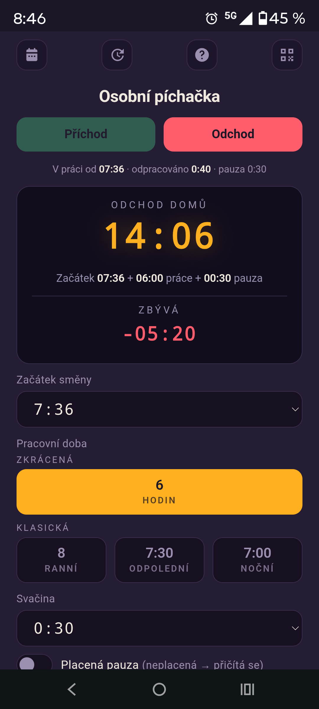
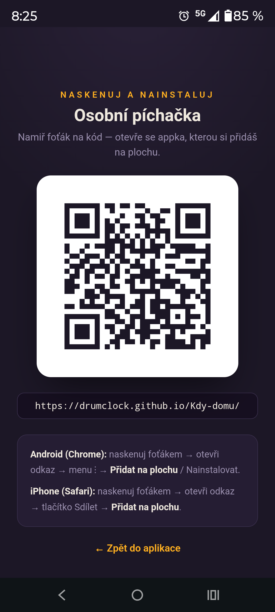
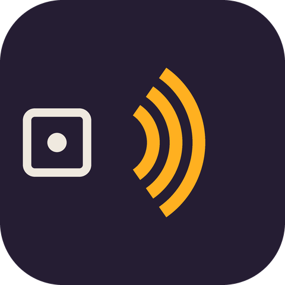

# Kdy můžu domů? ⏰

Jednoduchá webová appka (PWA), která spočítá, kdy můžeš odejít z práce — podle začátku směny, délky pracovní doby a pauzy na svačinu. Ukazuje živě, kolik ti ještě **zbývá**, nebo kolik už máš **přesčas**.

**▶️ Spustit appku: [drumclock.github.io/Kdy-domu](https://drumclock.github.io/Kdy-domu/)**

<p align="center">
  
  <br>
  <sub>Naskenuj foťákem a nainstaluj do telefonu</sub>
</p>

---

## Co appka umí

- **Výpočet odchodu** ze zadaného začátku směny.
- **Tlačítko „Teď"** — jedním ťuknutím nastaví aktuální čas jako začátek směny.
- **Pracovní doba** na jedno ťuknutí: 6 h (zkrácená) nebo klasická 8 h / 7:30 / 7:00 (ranní / odpolední / noční).
- **Svačina** s nastavitelnou délkou a přepínačem **placená / neplacená** (placená se do odchodu nepřičítá).
- **Živý odpočet** — kolik zbývá (červeně) nebo kolik je přesčas (zeleně), aktualizace každou vteřinu.
- **Připomínka do kalendáře** — vytvoří v telefonu událost na čas odchodu s upozorněním (funguje i při zavřené appce a zamčeném telefonu).
- **Zapamatování** — začátek směny se drží 9 h, délka směny a nastavení svačiny natrvalo.
- 
- **Automatické předvyplnění** aktuálního času při startu (dokud nemáš platný uložený začátek).
- **NFC** — přiložením telefonu k NFC štítku appka otevře a rovnou nastaví začátek směny.
- 
- **Funguje offline** a jde nainstalovat na plochu jako běžná aplikace.
- **QR kód** pro rychlé sdílení a instalaci na cizím telefonu.


---

## Náhledy

<p align="center">
  
  &nbsp;&nbsp;&nbsp;
  
</p>

---

## Instalace na mobil

Otevři v prohlížeči adresu **https://drumclock.github.io/Kdy-domu/** (nebo naskenuj QR kód výše) a přidej si ji na plochu.

### Android (Chrome)
1. Otevři odkaz v **Chromu** (ne ve vestavěném prohlížeči jiné appky).
2. Menu **⋮** vpravo nahoře → **Přidat na plochu** / **Nainstalovat aplikaci**.
3. Potvrď. Appka se objeví na ploše s vlastní ikonou.

> Tip: někdy je ikonka instalace přímo v adresním řádku.

### iPhone / iPad (Safari)
1. Otevři odkaz v **Safari**.
2. Ťukni na tlačítko **Sdílet** (čtvereček se šipkou nahoru).
3. Zvol **Přidat na plochu** → **Přidat**.

---

## Instalace na PC

Funguje v **Chromu** a **Microsoft Edge** (Firefox a Safari na počítači instalaci PWA nepodporují).

### Google Chrome
1. Otevři **https://drumclock.github.io/Kdy-domu/**.
2. V adresním řádku klikni na ikonu instalace (monitor se šipkou dolů) → **Nainstalovat**.
3. Případně: menu **⋮** → **Odesílat, ukládat a sdílet** → **Nainstalovat stránku jako aplikaci**.

### Microsoft Edge
1. Otevři tu samou adresu.
2. Menu **…** → **Aplikace** → **Nainstalovat tento web jako aplikaci**.

Po instalaci se appka spustí ve vlastním okně bez adresního řádku a získá zástupce v nabídce Start / Launchpadu.

---

## Jak se počítá odchod

```
odchod = začátek + pracovní doba + neplacená pauza
```

Placená pauza se počítá jako práce, takže odchod **neposouvá**. Když výpočet přesáhne půlnoc, u rozpisu se zobrazí poznámka „(další den)".

**Příklad:** začátek 7:39, směna 8 h, svačina 0:30 neplacená → odchod **16:09**.

---

## Připomínka v kalendáři

V rozích nahoře jsou dvě ikonky: **kalendář** (vlevo) a **QR** (vpravo). Kalendář vytvoří v telefonu událost „Odchod domů 🏠" na spočítaný čas s upozorněním — díky tomu tě telefon upozorní, i když je appka zavřená a obrazovka zamčená.

- **Android:** stáhne se soubor `odchod-domu.ics` → otevřeš ho → kalendář nabídne přidání události.
- **iPhone:** rovnou se nabídne přidání do kalendáře.
- **PC:** `.ics` otevřeš v Google / Outlook / Apple kalendáři.

Upozornění je v souboru nastavené **na čas události**. Pokud ti kalendář přidá vlastní výchozí připomínku (např. Google 30 min předem), vypni ji v nastavení kalendáře (výchozí připomínky účtu).

---

## NFC štítek



Appka rozumí parametrům v adrese, takže přiložením telefonu k NFC štítku může rovnou nastavit začátek směny:

<br clear="left">

| URL na štítku | Co udělá |
| --- | --- |
| `https://drumclock.github.io/Kdy-domu/?now` | Nastaví **aktuální čas** jako začátek |
| `https://drumclock.github.io/Kdy-domu/?start=06:00` | Nastaví **pevný čas** (zde 6:00) |

Po otevření se čas nastaví, appka spočítá odchod a parametr se z adresy odstraní (refresh ho už nezopakuje).

**Jak štítek zapsat:** pořiď si prázdný NFC tag a v appce jako **NFC Tools** (Android) zapiš na tag zvolenou URL jako záznam typu *URL/URI*. iPhone umí NFC URL číst sám; k zápisu použij podobnou appku. Štítek pak nalep třeba ke skříňce nebo píchačkám.

---

## Technické detaily

Appka je čistá **PWA** bez frameworků — jeden HTML soubor s vloženým CSS a JavaScriptem, plus manifest a service worker pro offline režim. Data se ukládají lokálně v prohlížeči (`localStorage`).

| Soubor | Popis |
| --- | --- |
| `index.html` | Samotná aplikace (HTML + CSS + JS) |
| `manifest.json` | Metadata PWA (název, ikony, barvy) |
| `sw.js` | Service worker — offline cache |
| `sdilet.html` | Sdílecí stránka s QR kódem a návodem |
| `qr.png` | QR kód s adresou aplikace |
| `nfc.png` | Ikonka NFC pro README |
| `screenshot-app.png`, `screenshot-qr.png` | Náhledy do README |
| `icon-192.png`, `icon-512.png`, `icon-maskable.png` | Ikony aplikace |

### Vlastní hosting (GitHub Pages)
1. Nahraj soubory do kořene repozitáře.
2. **Settings → Pages → Source: Deploy from a branch → main / (root)**.
3. Za chvíli appka běží na `https://<uživatel>.github.io/<repo>/`.

Podmínka pro instalaci PWA je **https** — to GitHub Pages zajišťuje zdarma.

---

## Omezení

Jako webová appka **sama neumí zvukový budík na pozadí** — pípnutí přímo v appce by zaznělo jen při zapnuté appce s rozsvícenou obrazovkou. Na spolehlivé upozornění při zamčeném telefonu proto slouží **připomínka v kalendáři** (viz výše), kterou zajistí systémový kalendář.

---

<sub>Vytvořeno jako hobby projekt. 🙂</sub>
